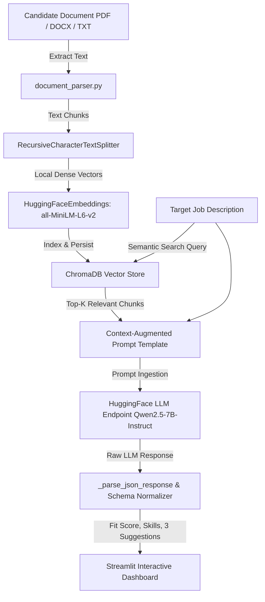

# AI Resume Screener & Career Advisor — RAG Engine

An end-to-end **Retrieval-Augmented Generation (RAG)** application built with **Streamlit**, **LangChain**, **ChromaDB**, and **Hugging Face**.

Unlike generic chatbot wrappers, this application embeds candidate resumes into local vector space and performs semantic similarity retrieval to evaluate candidate fit against job descriptions, outputting structured JSON metrics

---

## 📐 System Architecture



---

## ✨ Core Features & Problem Statement Implementation

1. **Structured Evaluation Output**:
   - **Fit Score**: Quantitative compatibility metric (0 to 100).
   - **Matched Skills**: Technical and domain qualifications present in the resume.
   - **Missing Skills**: Requirements specified in the job description but absent from the resume.
   - **Exactly 3 Actionable Suggestions**: High-impact, concrete recommendations to optimize the resume for the specific role.

2. **Interactive RAG Workflow Visualizer (Interview Demonstration)**:
   - Built-in live inspector demonstrating all 7 stages of RAG:
     1. Raw Text Parsing
     2. Document Chunking Snippets
     3. 384-Dimensional Dense Vector Embeddings (Sample Vector Float Output)
     4. ChromaDB Vector Store Metadata & Collection Stats
     5. Top-K Vector Cosine Distance Similarity Scores
     6. Context-Augmented Prompt Construction
     7. LLM Response & JSON Schema Validation

3. **Multi-Turn Context-Aware Follow-Up Chat**:
   - Grounded in both the active candidate resume vector database AND the active job description context.
   - Ideal for interview preparation, addressing skill gaps, and drafting cover notes.

4. **Comprehensive Error Handling & Edge Cases**:
   - **Scanned/Image PDFs**: Detects zero-text PDFs and alerts the user with actionable instructions.
   - **Unsupported File Types**: Rejects non-document extensions with clear warning banners.
   - **API Resiliency**: Catches missing API tokens, model 503 loading status, and network timeouts.
   - **JSON Fallback Repair**: Strips markdown formatting and normalizes schema outputs automatically.

---

## 📁 Repository Structure

```
resume-rag-streamlit/
├── app.py               # Streamlit multi-tab dashboard & RAG Visualizer
├── rag_pipeline.py       # LangChain LCEL chains, Chroma DB, Hugging Face LLM, schema normalizer
├── document_parser.py    # Multi-format text extraction (PDF, DOCX, TXT) with error validation
├── config.py              # Environment configuration & settings management
├── test_pipeline.py      # Automated unit & integration test suite
├── requirements.txt       # Python dependencies
├── .env                   # Environment variables (API token, models)
└── data/chroma/           # Local persistent Chroma vector store directory
```

---

## 🛠️ Step-by-Step Execution Flow

1. **Document Ingestion (`document_parser.py`)**:
   - Accepts uploaded file bytes (PDF via `pypdf`, DOCX via `python-docx`, TXT via UTF-8).
   - Cleans control characters, strips excessive whitespace, and verifies readable character count (>30 chars).

2. **Chunking & Vector Storage (`rag_pipeline.py`)**:
   - Splits document text into ~800-character segments with 120-character overlap using `RecursiveCharacterTextSplitter`.
   - Computes 384-dimensional dense vectors locally using `sentence-transformers/all-MiniLM-L6-v2`.
   - Stores vectors and metadatas (`resume_id`, `chunk_index`, `char_count`) in an isolated ChromaDB collection.

3. **Top-K Semantic Retrieval (`rag_pipeline.py`)**:
   - Converts the target Job Description into an embedding vector.
   - Queries ChromaDB for the top-5 candidate resume chunks with lowest cosine distance.

4. **Augmented Prompt Construction (`SCREEN_PROMPT`)**:
   - Merges retrieved resume excerpts and job description into a structured prompt template.

5. **Structured LLM Scoring & Schema Validation (`_validate_and_normalize_screener_schema`)**:
   - Ingests prompt via Hugging Face Endpoint API (`Qwen/Qwen2.5-7B-Instruct`).
   - Extracts JSON content, validates numerical ranges, and guarantees **exactly 3** actionable recommendations.

---

## ⚡ Local Setup & Execution Guide

### Prerequisites
- Python 3.10+
- Hugging Face API Token (Free tier available at [huggingface.co/settings/tokens](https://huggingface.co/settings/tokens))

### 1. Clone & Setup Environment
```bash
git clone <repository_url>
cd resume-rag-streamlit

# Create virtual environment
python -m venv venv

# Activate virtual environment
# Windows:
venv\Scripts\activate
# Linux/macOS:
source venv/bin/activate
```

### 2. Install Dependencies
```bash
pip install -r requirements.txt
```

### 3. Configure Environment Variables
Create or edit `.env` in the project root:
```env
HUGGINGFACEHUB_API_TOKEN=your_huggingface_api_token_here
HF_LLM_REPO_ID=Qwen/Qwen2.5-7B-Instruct
HF_EMBEDDING_MODEL=sentence-transformers/all-MiniLM-L6-v2
CHROMA_PERSIST_DIR=./data/chroma
CHUNK_SIZE=800
CHUNK_OVERLAP=120
TOP_K_RESULTS=5
```

### 4. Run Unit Tests
```bash
python -m unittest test_pipeline.py
```

### 5. Launch Application
```bash
streamlit run app.py
```
Open your browser at `http://localhost:8501`.

---

## 🌐 Deployment Instructions

### Option A: Streamlit Community Cloud (Recommended)
1. Push repository to GitHub.
2. Visit [share.streamlit.io](https://share.streamlit.io) and log in.
3. Click **New app** and select your repository & branch (`main`).
4. Set Main file path: `app.py`.
5. Under **Advanced settings... -> Secrets**, add your API token:
   ```toml
   HUGGINGFACEHUB_API_TOKEN = "your_hf_token_here"
   ```
6. Click **Deploy!**

### Option B: Hugging Face Spaces
1. Create a new Space on [huggingface.co/new-space](https://huggingface.co/new-space).
2. Select **Streamlit** as the Space SDK.
3. Commit files (`app.py`, `rag_pipeline.py`, `document_parser.py`, `config.py`, `requirements.txt`).
4. In Space **Settings -> Secret keys**, add `HUGGINGFACEHUB_API_TOKEN`.

### Option C: Render
1. Create a **Web Service** connected to your GitHub repository.
2. Select environment: **Python 3**.
3. Build Command: `pip install -r requirements.txt`
4. Start Command: `streamlit run app.py --server.port $PORT --server.address 0.0.0.0`
5. Add `HUGGINGFACEHUB_API_TOKEN` under Environment Variables.

---

## 💡 Key Engineering Challenges & Solutions

| Challenge | Impact | Engineering Solution |
| :--- | :--- | :--- |
| **Non-Deterministic JSON Output** | Open-source HF instruct models occasionally output markdown or commentary. | Developed `_parse_json_response` with regex extraction, markdown block stripping, trailing comma repair, and `_validate_and_normalize_screener_schema` fallback logic. |
| **Streamlit File Watcher Conflict** | PyTorch dynamic classes triggered Streamlit reloading errors. | Applied `torch.classes.__path__ = []` patch at application initialization. |
| **Session & Vector Isolation** | Multi-user document uploads could pollute retrieval results. | Implemented collection namespacing (`resume_{uuid}`) in ChromaDB so searches are strictly scoped to the active session ID. |
| **Unreadable & Scanned PDFs** | Image-only PDFs resulted in empty context and zero score retrieval errors. | Implemented custom text length validation in `document_parser.py` throwing explicit user-actionable instructions. |

---

## 🧪 Testing Results

All unit tests in `test_pipeline.py` pass cleanly:
- `test_document_parser_valid_txt`: OK
- `test_document_parser_unsupported_format`: OK
- `test_document_parser_empty_file`: OK
- `test_rag_indexing_and_retrieval`: OK
- `test_schema_normalization_enforces_exact_fields`: OK
- `test_json_parser_robustness`: OK
